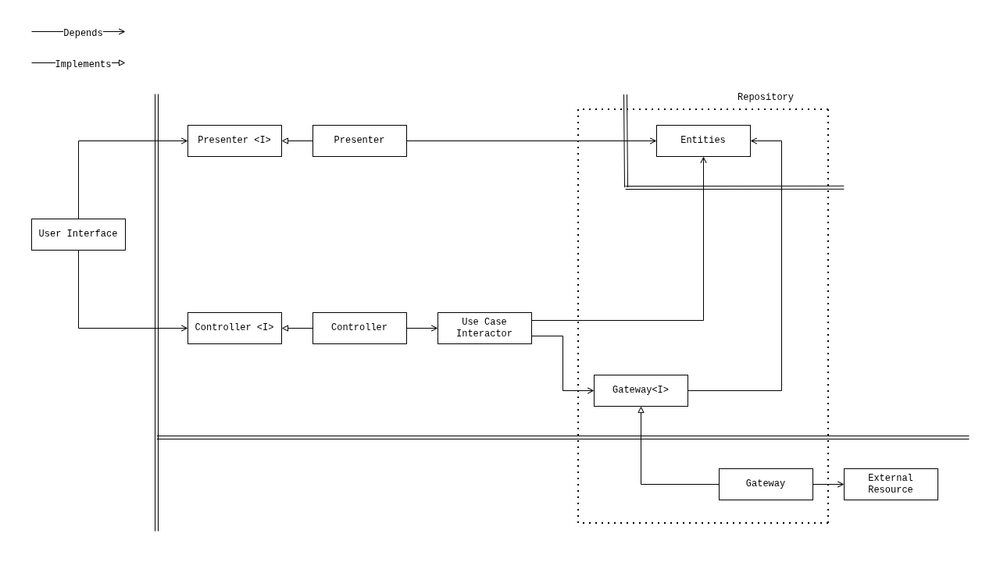
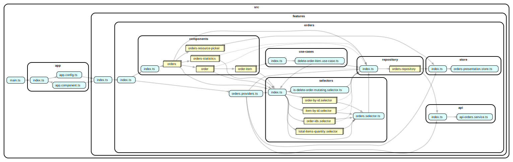

# Clean Reactive Architecture — Angular + TanStack Query Sample

A sample application that demonstrates
[Clean Reactive Architecture](https://github.com/clean-reactive/documentation/blob/main/docs/architecture.md) implemented with Angular and TanStack Query.

The sample shows a concrete, working mapping of every architectural unit from
the diagram to idiomatic Angular code. It covers entities, gateway interfaces,
repositories, use cases, selectors, presenters, controllers, and the user
interface — with unit and integration tests for each layer.

## Getting started

Install dependencies:

```sh
npm ci
```

Start the development server:

```sh
npm start
```

## Tech stack

- [Angular](https://angular.dev/) 21
- [TanStack Query](https://tanstack.com/query/latest) (`@tanstack/angular-query-experimental`)
- [TypeScript](https://www.typescriptlang.org/)
- [Tailwind CSS](https://tailwindcss.com/) + [daisyUI](https://daisyui.com/)
- [Vitest](https://vitest.dev/) + [Angular Testing Library](https://testing-library.com/docs/angular-testing-library/intro/)
- [MSW](https://mswjs.io/) for network-level HTTP interception in gateway tests
- [dependency-cruiser](https://github.com/sverweij/dependency-cruiser) for dependency validation and graph visualization

## Architecture mapping

The table below shows how each unit from the Clean Reactive Architecture diagram
maps to this codebase.

| Architectural unit | Angular equivalent | Location |
| --- | --- | --- |
| Application business entity | Injectable class with Angular `signal` | `store/orders-presentation.store.ts` |
| Enterprise business entity | TypeScript type | `repository/orders-repository/orders.repository.types.ts` |
| Gateway interface | TypeScript interface + `InjectionToken` | `OrdersGateway` in `orders.gateway.ts` |
| Repository (gateway + entities) | Injectable class with TanStack Query | `repository/orders-repository/orders.repository.ts` |
| Gateway implementation | Injectable class implementing `OrdersGateway` | `InMemoryOrdersService`, `RemoteOrdersService` |
| Use case interactor | Injectable class | `use-cases/delete-order-item.use-case.ts` |
| Selector | Injectable class with `computed` | `selectors/order-ids.selector`, `order-by-id.selector`, `total-items-quantity.selector`, … |
| Presenter | Injectable class returning a view models | `components/orders/orders.presenter.ts`, `components/order/order.presenter.ts` |
| Controller | Injectable class returning callbacks | `components/order/order.controller.ts`, `components/order-item/order-item.controller.ts` |
| User interface | Angular component | `components/orders`, `components/order`, `components/order-item` |

## Key design decisions

**Application business entity as an Angular signal-based class.**
`OrdersPresentationStore` holds application-level state (`ordersResource:
"local" | "remote"`) that persists across use case calls and has its own rules.
It is managed by a dedicated injectable class backed by Angular signals, not
by TanStack Query.

**Repository as a TanStack Query injectable class.** The `OrdersRepository` is
a composite of the gateway interface and the enterprise business entity. It
exposes `OrdersGateway` behaviour through `injectQuery` / `injectMutation`
calls and owns the entity cache that presenters and selectors read from.

**Gateway implementations resolved at runtime via Angular DI.**
`I_ORDERS_GATEWAY` is an `InjectionToken` that is provided with either
`InMemoryOrdersService` or `RemoteOrdersService` depending on the
`ordersResource` value stored in the application business entity. The active
implementation can change without any structural change to the architecture.

**Injectable classes as architectural units.** Angular injectable classes are
the natural host for use cases, selectors, presenters, and controllers. Each
class has a single, clearly scoped responsibility that matches exactly one
architectural unit.

**Signals for reactive state.** Selectors and presenters expose their results as
Angular `Signal` / `computed` values, enabling fine-grained reactive updates
without RxJS streams.

**Dependency graph.** `dependency-cruiser` is configured to detect circular
dependencies, orphan modules, and unresolvable imports. The `deps:graph` script
generates a visual SVG of the module graph.

## UML diagram representing application architecture



## Folder structure

```console
src/features
└── orders
    ├── api                         # external resource (HTTP client + API)
    │   ├── orders-api.factory.ts
    │   ├── orders-http.service.ts
    │   └── types.ts
    ├── components                  # user interface, presenters, controllers
    │   ├── order
    │   │   ├── order.component.ts
    │   │   ├── order.component.html
    │   │   ├── order.context.ts
    │   │   ├── order.controller.ts
    │   │   ├── order.presenter.ts
    │   │   └── order.types.ts
    │   ├── order-item
    │   │   ├── order-item.component.ts
    │   │   ├── order-item.component.html
    │   │   ├── order-item.context.ts
    │   │   ├── order-item.controller.ts
    │   │   ├── order-item.presenter.ts
    │   │   └── order-item.types.ts
    │   ├── orders
    │   │   ├── orders.component.ts
    │   │   ├── orders.component.html
    │   │   ├── orders.presenter.ts
    │   │   └── orders.types.ts
    │   ├── orders-resource-picker
    │   └── orders-statistics
    ├── repository                  # repository, gateway interface, gateway implementations
    │   └── orders-repository
    │       ├── in-memory-orders-service
    │       │   └── in-memory-orders.service.ts
    │       ├── orders.gateway.ts
    │       ├── orders.repository.ts
    │       ├── orders.repository.types.ts
    │       ├── orders.repository.utils.ts
    │       ├── orders.service.ts
    │       └── remote-orders.service.ts
    ├── selectors                   # selectors
    │   ├── is-delete-order-mutating.selector.ts
    │   ├── item-by-id.selector
    │   ├── order-by-id.selector
    │   ├── order-ids.selector
    │   ├── orders.selector.ts
    │   └── total-items-quantity.selector
    ├── store                       # application business entity
    │   └── orders-presentation.store.ts
    ├── use-cases                   # use case interactors
    │   └── delete-order-item.use-case.ts
    ├── orders.providers.ts
    └── test-ids.ts
```

## Further reading

- [Clean Reactive Architecture](https://github.com/clean-reactive/documentation/blob/main/docs/architecture.md)
- [Development Methodology](https://github.com/clean-reactive/documentation/blob/main/docs/methodology.md)

## Dependency graph


